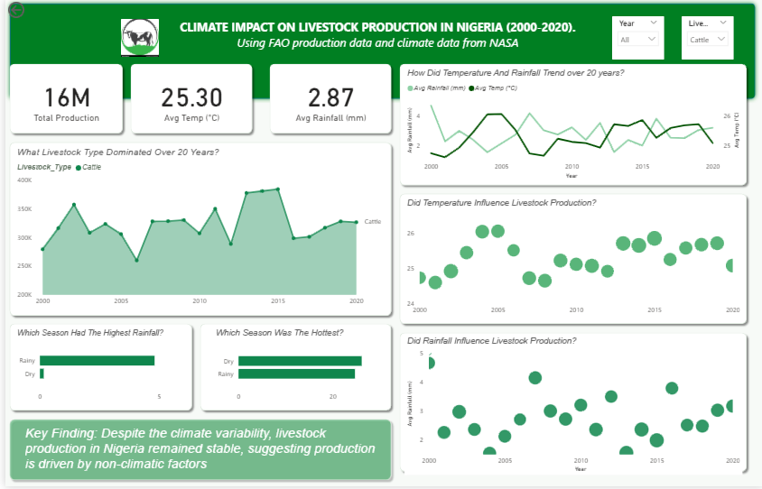
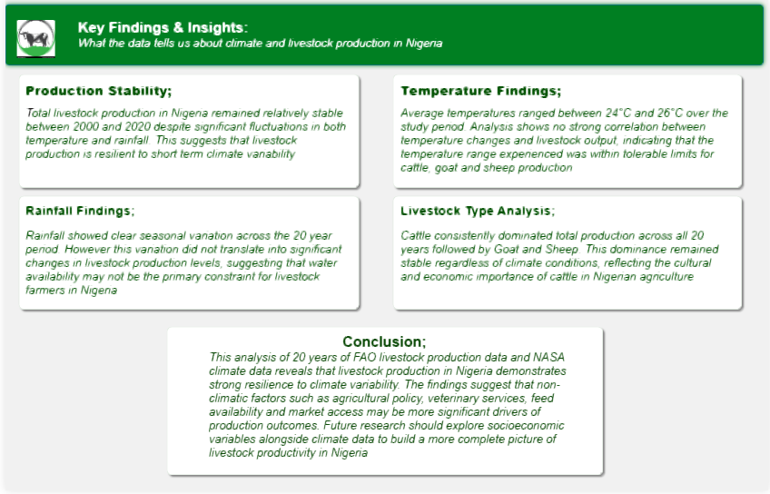

# Climate Impact on Livestock Production in Nigeria (2000–2020)

## Project Overview
This project explores whether climate variables such as temperature 
and rainfall significantly influence livestock production in Nigeria 
over a 20-year period (2000–2020). The analysis was conducted using 
Microsoft Power BI with data sourced from FAO and NASA.

## Objectives
- Analyze 20 years of climate and livestock production trends
- Determine correlation between temperature, rainfall and livestock output
- Compare production patterns across Cattle, Goat and Sheep
- Communicate findings through interactive visualizations

## Key Findings
- Livestock production remained stable despite climate variability
- No strong correlation found between temperature or rainfall and production
- Cattle consistently dominated production across all 20 years
- Seasonal rainfall variation did not significantly impact output

## Data Sources
| Dataset | Source | Period |
|---------|--------|--------|
| Livestock Production | FAO Global Database | 2000-2020 |
| Climate Data | NASA Climate Dataset | 2000-2020 |

## Dashboard Preview
### Page 1 — Climate & Production Overview

### Page 2 — What The Data Tells Us

## Tools Used
- Microsoft Power BI Desktop
- Microsoft Excel
- FAO and NASA open datasets

## Skills Demonstrated
- Data visualization and dashboard design
- Climate and agricultural data analysis
- Power BI formatting and DAX measures
- Data storytelling and insight communication
- Multi-source data integration

## Author
*JohnTheAnalyst00*
Animal Scientist | Data Analyst
Based in Nigeria
